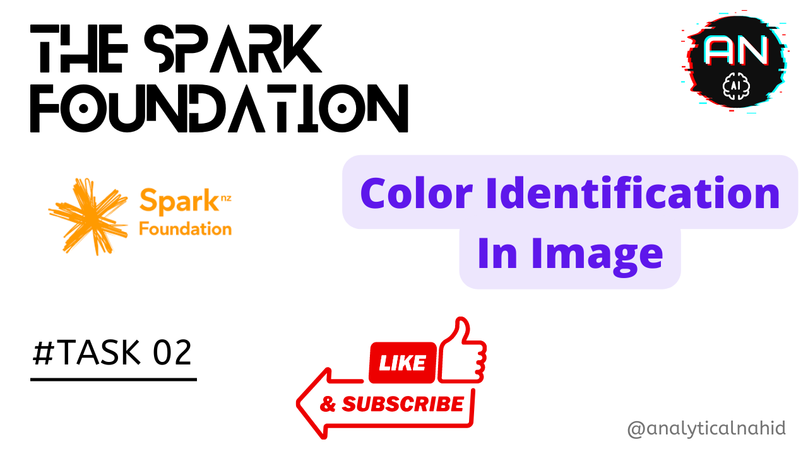

# Color Detection App
An simple end to end color detection using OpenCV.



## How it works?
Checkout my youtube video-> https://youtu.be/tks_2EUGVLA

## Try Demo!
No need to install try it out -> https://color-detectionapp.herokuapp.com/

## Requirements
- numpy==1.22.4
- opencv_python==4.6.0.66
- streamlit==1.10.0

## Installation
Must have to satisfy all the requirements

```bash
  streamlit run app.py
```

## FAQ

#### When to use it?
Whenever you need to detect color in a given image or video.


## 🔗 Links
<h2 align="center">Connect with me:</h2>  
<p align="center">
<a href="https://twitter.com/analyticalnahid" target="blank"></a>
<a href="https://linkedin.com/in/analyticalnahid" target="blank"></a>
<a href="https://github.com/analyticalnahid" target="blank"></a>
<a href="https://facebook.com/iamtechnicalnahid" target="blank"></a>
<a href="https://instagram.com/analyticalnahid" target="blank"></a>
<a href="https://analyticalnahid.medium.com" target="blank"></a>
<a href="https://www.youtube.com/channel/UCLeFKnFwC11FQWvtFk32vJQ" target="blank"></a>
</p>

